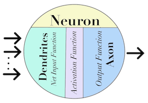
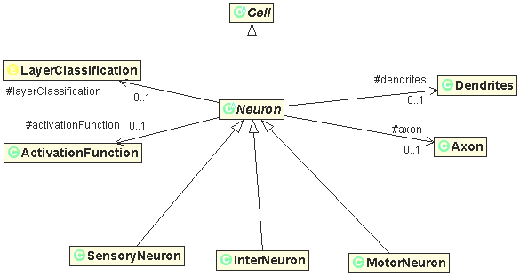

# OOP-Neuron-Modeling
Object Oriented Class Definitions for a Logical Neuron Unit 
 
This collection of classes models a fully functional Logical Neuron Unit. 
Class Neuron is abstract, and therefore you must instantiate one of its three concrete classes; InterNeuron, MotorNeuron, SensoryNeuron. 
Additionally, a faux Neuron class called InputSignal must be used to send a signal to any instantiated Neuron in the network. However, InputSignal should not receive a signal from any other Object 
Together, these classes provide a powerful and fully functional implementation for the groundwork of an ANN (Artificial Neural Netork).

The combined data structure which allows the calculations of signals to be made on the fly, is a DAG (Directed Acyclic Graph) with doubley linked list nodes, implementated by a Map<Neuron,Double> in class Dendrite and a List<Neuron> in class Axon that see backward and forward in the DAG, respectively.

The software application Neural Network Explorer, created by Lance Dooley, is a fully functional implementation of this collection of classes.

Things to note: the signal sent out from any Neuron is squashed between (0.000d and 1.000), inclusive. 
Weights for the Dendrites of any Neuron are restricted between (-1.000d and 1.000d), inclusive. 

UML Class Diagram for Neuron shown below. 
The following relationships are implied ... 
Neuron is a Cell. 
InterNeuron is a Neuron. 
MotorNeuron is a Neuron. 
SensoryNeuron is a Neuron. 
Neuron has a LayerClassification. 
Neuron has an ActivationFunction. 
Neuron has a Dendrites. 
Neuron has an Axon. 

